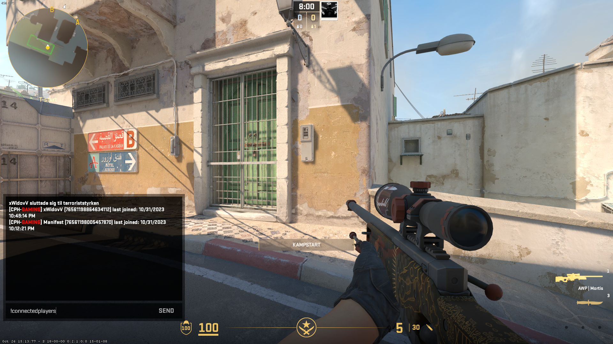

# cs2-connectionlogs
 Create a folder called ConnectionLogs inside your /plugins/ folder.
 Use the compiled versoin: Drag the files from `\bin\Release\net7.0\publish` inside of the ConnectionLogs folder except from `CounterStrikeSharp.API.dll`
 Compile yourself: Replace `<HintPath>E:\Github\cs2-cph\API\CounterStrikeSharp.API.dll</HintPath>` inside of the ConnectionLogs.csproj and then run _compile.bat to compile the plugin, it will be placed in `\bin\Release\net7.0\publish` folder.

# Dependencies
- [CounterStrikeSharp](https://docs.cssharp.dev/)
- [Metamod](https://www.sourcemm.net/downloads.php/?branch=master)

## Description
This plugin adds players to a database to track when they join.
It prints to discord through a webhook when a player joins and leaves.
It has a command !connectedplayers that prints the 50 recent players that joined the server.

## Config
The config will automaticly be generated on first run and will be placed inside of the same directory as the plugin itself.
Colors can be used in the "ChatPrefix" like so {White} or {Red}, every color in the ChatColors class can be used.
Example:
```json
{
  "ChatPrefix": "[CPH-{Darkred}GAMING{White}]",

  "SendMessageToDiscord": true,
  "DiscordWebhook": "https://discord.com/api/webhooks/",

  "StoreInDatabase": true,
  "DatabaseHost": "192.168.1.210",
  "DatabasePort": 3306,
  "DatabaseUser": "WidovV",
  "DatabasePassword": "MySuperSecretPassword",
  "DatabaseName": "test-connectionlogs"
}
```



